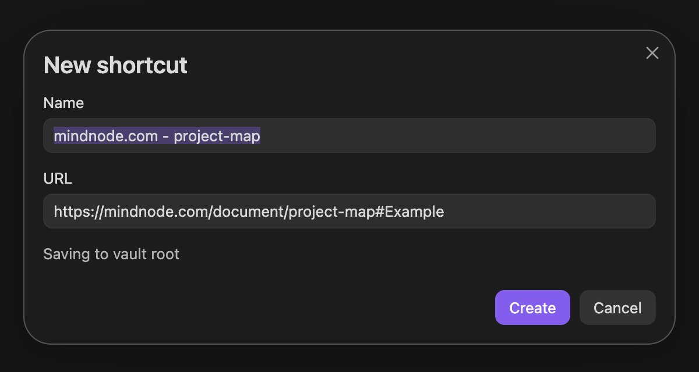

# Elsewhere

Many applications keep your work inside their own libraries rather than storing it as regular files you can save and organize anywhere in your computer's file system. A MindNode map, a Google Sheet, or even a specific email in Mimestream may not live in your project folder—but each can give you a direct link through a command such as **Copy Link** or **Copy Link to Document**.

>**Elsewhere** turns those links into standard Internet Shortcut files (`.url`) that you can store beside the relevant notes in your Obsidian project folders. 

Open a shortcut in Obsidian to return to the linked webpage, document, item in another app, or email. The shortcut remains a regular file that Finder and Windows File Explorer can also open.

## How to use

### Create a new shortcut

1. Open the command palette or right-click a file or folder and select **New shortcut...**.
2. Enter the destination in the dialog by typing or pasting a URL or full file path. For a faster start, copy it before opening the dialog, and Elsewhere will fill it in:
   - In a browser, copy the page URL.
   - In an app such as MindNode or Mimestream, use **Copy Link**, **Copy Link to Document**, or the equivalent command.
   - For a local file, copy its full path or `file:` URL.
3. Review the suggested name and destination, then select **Create**.
4. Open the new `.url` file to return to the linked destination.

Elsewhere suggests filenames based on the destination. If a name is already taken, it shows the numbered name it will use instead and never overwrites the existing file.

### Edit an existing shortcut

To change the shortcut name or destination, right-click the shortcut and select **Edit shortcut...**.

## Supported destinations

- Web links such as `https://example.com`
- Links copied from apps, whether they look like ordinary web links or use an app-specific format such as `obsidian:`, `things:`, or `zotero:`
- Local files using `file:` URLs
- Full macOS and Windows file paths, including Windows network paths
- Paths in your home folder beginning with `~`

Enter a complete web link, including `https://`, rather than a hostname such as `example.com`. For safety, links using `javascript:`, `data:`, or `vbscript:` are not accepted.

A link copied from an app may look like a regular web link and still open that app. Whether it works offline depends on the app and the kind of link it provides.

## Installation

1. Open **Settings → Community plugins** and select **Browse**.
2. Search for **Elsewhere**, then select **Install** and **Enable**.

See Obsidian's [community plugin instructions](https://obsidian.md/help/community-plugins) for general installation and security guidance.

## Compatibility and limitations

- Requires Obsidian 1.4.0 or later on macOS or Windows desktop.
- Mobile is not supported.
- If another plugin already handles `.url` files, you may need to disable one of them.
- On macOS, opening a `.url` file directly in Finder may open Safari even when another browser is your default. Opening it through Elsewhere uses your default browser or the appropriate app instead.

## Privacy

Everything stays local. Elsewhere reads the clipboard only after you select **New shortcut...**, creates filename suggestions without contacting the internet, and writes shortcut files only to your vault. It has no accounts, tracking, analytics, or background network requests.

## Support and contributing

Use [GitHub Issues](https://github.com/Alan-Christiansen/Elsewhere/issues) for bug reports and feature suggestions. Small fixes and documentation improvements are welcome as pull requests; please open an issue before starting a substantial feature or behavior change. See [CONTRIBUTING.md](CONTRIBUTING.md) for details.

Created and maintained by Alan Christiansen under Spectra Studio.

Elsewhere is available under the [MIT License](LICENSE).
